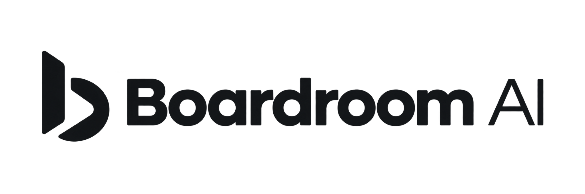

<div align="center">



### AI-powered boardroom intelligence for founders

**Pitch your startup. Challenge it with an AI executive board. Leave with a decision and an execution plan.**

[](https://nextjs.org/)
[](https://www.typescriptlang.org/)
[](https://groq.com/)
[](https://supabase.com/)

**HackAgent**

</div>

---

## ✦ What is BoardroomAI?

**BoardroomAI is an AI-powered virtual board of directors built for startup founders.**

Instead of asking one AI for an opinion, founders can put their pitch in front of a complete executive board. Each AI executive brings a different perspective, debates the other executives in real time, votes on the opportunity, and turns the discussion into actionable startup intelligence.

### The board

| Executive | Perspective |
|---|---|
| **CEO** | Vision, strategy & business model |
| **CTO** | Technology, architecture & feasibility |
| **CFO** | Financials, unit economics & capital |
| **CMO** | Positioning, brand & go-to-market |
| **VC** | Investability, traction & returns |
| **Legal** | Risks, compliance & defensibility |
| **Research** | Market, competitors & evidence |
| **Growth** | Acquisition, retention & scalability |

> **One pitch → eight perspectives → live debate → board vote → complete startup intelligence.**

---

## ⚡ Why BoardroomAI?

Founders usually get fragmented feedback:

- One mentor gives a strategic opinion.
- An investor focuses on the market.
- An engineer focuses on the product.
- A finance expert focuses on the numbers.

**BoardroomAI brings those perspectives into one room.**

The result isn't just a chatbot response. The platform creates a simulated executive discussion where different agents can **challenge assumptions, disagree, defend positions, and converge on a decision.**

---

## 🧠 How it works

```text
                    ┌───────────────────┐
                    │      Founder      │
                    │   Submit a Pitch  │
                    └─────────┬─────────┘
                              │
                              ▼
              ┌──────────────────────────────┐
              │       AI BOARDROOM           │
              │                              │
              │ CEO  CTO  CFO  CMO           │
              │ VC   LEGAL RESEARCH GROWTH   │
              │                              │
              │   Debate → Challenge → Vote  │
              └──────────────┬───────────────┘
                             │
                             ▼
                   ┌────────────────────┐
                   │   Board Decision   │
                   │ Score + Verdict    │
                   └─────────┬──────────┘
                             │
            ┌────────────────┼────────────────┐
            ▼                ▼                ▼
       Market Research   Financials       Startup Health
            │                │                │
            └────────────────┼────────────────┘
                             ▼
                  ┌─────────────────────┐
                  │   Founder Toolkit   │
                  │                     │
                  │ Report • PRD        │
                  │ Pitch Deck • Roadmap│
                  │ SWOT • Risk Matrix  │
                  └─────────────────────┘
```

---

## 🚀 What a session produces

Once a founder submits a pitch, BoardroomAI creates a meeting, seats the selected executives, and runs the board debate.

When the debate concludes, the system generates:

### 📊 Investment Report
- Overall score
- Investment verdict
- Executive summary
- SWOT analysis
- Dimension scores
- Risk matrix
- Financial highlights

### 🔎 Market Research
- Market sizing
- Growth trends
- Competitor analysis
- Market opportunities

### 💰 Financial Intelligence
- Revenue model
- Expense projections
- KPIs
- Cap table
- Financial highlights

### ❤️ Startup Health
- Overall health score
- Dimension radar
- Key flags
- Business health snapshot

### 🧩 Product Requirements
- Structured PRD
- Product sections
- Generated specifications

### 🎤 Pitch Deck
- Slide outline
- Slide content
- Presentation-ready structure

### 🗺️ Execution
- Roadmap
- Kanban workflow
- Version history
- Executive-level recommendations

---

## 🏗️ Tech Stack

| Layer | Technology |
|---|---|
| Frontend | **Next.js 16 + React + TypeScript** |
| Styling | **Tailwind CSS + design tokens** |
| AI | **Groq** |
| Authentication | **Supabase Auth** |
| Database | **Supabase Postgres** |
| Storage | **Supabase Storage** |
| UI primitives | **Radix UI** |
| Motion | **Motion / Framer Motion patterns** |

### Architecture principle

```text
UI
 │
 ▼
Feature Service
 │
 ▼
API Contract
 │
 ▼
Server Domain Logic
 │
 ├──────────────► Groq AI
 │
 └──────────────► Supabase
```

The codebase intentionally keeps responsibilities separated:

- Features own their UI, service, and types.
- Route handlers call server-domain logic.
- Only `lib/ai/groq.ts` communicates with the model.
- Only `lib/supabase/*` constructs Supabase clients.
- API contracts live in `types/api.ts`.
- Model output is normalized before reaching components.

---

## 📁 Project Structure

```text
app/
  (app)/                  # Authenticated application routes
  (marketing)/            # Marketing pages
  api/                    # API route handlers
  auth/                   # Auth callbacks & sign-out
  page.tsx                # Landing page
  layout.tsx              # Root layout

components/
  ui/                     # UI primitives
  shared/                 # Shared composed components
  layout/                 # App + marketing layouts

features/
  <name>/                 # Feature-first architecture
    components/
    service.ts
    types.ts

hooks/                    # Reusable application hooks

lib/
  ai/                     # Groq client, personas & generators
  server/                 # Domain logic
  supabase/               # Supabase clients

providers/                # App providers
constants/                # Design tokens & navigation
types/                    # Shared API & domain contracts

supabase/
  migrations/             # Database schema + RLS

proxy.ts                  # Route protection
```

---

## 🛣️ Routes

### Marketing

| Route | Purpose |
|---|---|
| `/` | Landing page |
| `/pricing` | Pricing + FAQ |
| `/about` | Mission, values & board roster |
| `/login` | Authentication |
| `/auth/forgot-password` | Password recovery |
| `/auth/update-password` | Password update |

### Application

| Route | Purpose |
|---|---|
| `/dashboard` | Metrics, score trends & activity |
| `/meeting/new` | Submit a startup pitch |
| `/boardroom` | Live AI executive debate |
| `/reports` | Searchable report history |
| `/reports/[id]` | Full investment report |
| `/market-research` | Market intelligence |
| `/financials` | Financial model & KPIs |
| `/startup-health` | Startup health analysis |
| `/executives` | AI executive roster |
| `/pitch-deck` | Generated pitch deck |
| `/prd-generator` | Product requirements |
| `/kanban` | Visual execution board |
| `/history` | Version timeline |
| `/settings` | Profile, workspace & preferences |

---

## 🔐 Getting Started

### 1. Clone the repository

```bash
git clone <your-repository-url>
cd BoardroomAI
```

### 2. Install dependencies

```bash
npm install
```

### 3. Configure environment variables

Copy the example environment file:

```bash
cp .env.example .env.local
```

Then configure:

```env
GROQ_API_KEY=your_groq_api_key

NEXT_PUBLIC_SUPABASE_URL=your_supabase_url
NEXT_PUBLIC_SUPABASE_ANON_KEY=your_supabase_anon_key
```

Get a Groq API key from the [Groq Console](https://console.groq.com/keys).

### 4. Configure Supabase

Run both migrations from:

```text
supabase/migrations/
```

Run them **in filename order**.

Enable the authentication providers you want and configure:

```text
/auth/callback
```

as the authentication redirect.

### 5. Start the application

```bash
npm run dev
```

Open:

```text
http://localhost:3000
```

Then:

1. Open `/`
2. Sign in
3. Go to `/meeting/new`
4. Submit your pitch
5. Select the executives
6. Enter the boardroom
7. Watch the board debate
8. Review the decision and generated deliverables

### Health check

Verify your configuration with:

```text
/api/health
```

The endpoint reports:

- `dbConfigured`
- `aiConfigured`

without requiring an authenticated session.

---

## 🎯 Product Flow

```text
SIGN IN
   ↓
SUBMIT PITCH
   ↓
SELECT EXECUTIVES
   ↓
ENTER BOARDROOM
   ↓
LIVE AI DEBATE
   ↓
BOARD VOTE
   ↓
INVESTMENT DECISION
   ↓
┌───────────────────────────────────────┐
│ REPORT                                │
│ MARKET RESEARCH                       │
│ FINANCIAL MODEL                       │
│ STARTUP HEALTH                        │
│ SWOT + RISK MATRIX                    │
│ PRD                                   │
│ PITCH DECK                            │
│ ROADMAP                               │
└───────────────────────────────────────┘
```

---

## 🧩 Engineering Conventions

### Feature-first

Each feature owns its:

```text
components/
service.ts
types.ts
```

Components communicate through the feature service rather than directly accessing Supabase.

### Single AI boundary

Only:

```text
lib/ai/groq.ts
```

talks directly to the model.

### Single Supabase boundary

Only:

```text
lib/supabase/*
```

constructs Supabase clients.

### Central contracts

API contracts live in:

```text
types/api.ts
```

Changing a contract should surface type errors on both sides.

### Normalized AI output

AI responses are normalized before they reach UI components. See the `normalise*` helpers in:

```text
lib/ai/report-generator.ts
```

### Design system

Avoid hardcoded colors, shadows, and easing values.

Use:

```text
tailwind.config.ts
lib/motion.ts
constants/design-tokens.ts
```

### Accessibility

Interactive components should include:

- Keyboard accessibility
- Focus-visible states
- ARIA wiring
- Reduced-motion support
- Radix primitives where appropriate

---

## 📜 Scripts

```bash
npm run dev        # Start development server
npm run build      # Build production application
npm run lint       # Run ESLint
npm run typecheck  # Run TypeScript checks
```

---

## ⚠️ Known Gaps

Current backend limitations are documented in [`BACKEND.md`](./BACKEND.md).

Notable gaps include:

- Deck upload
- Billing actions
- Persistent Kanban drag-and-drop

---

## 🔮 Vision

BoardroomAI is built around a simple idea:

> **Founders shouldn't have to wait for a room full of experts to stress-test an idea.**

The future of startup decision-making can be **interactive, multi-perspective, evidence-driven, and available on demand.**

BoardroomAI turns an early-stage idea into a boardroom conversation — and turns that conversation into an execution system.

---

<div align="center">

### Built with AI. Designed for founders. ⚡

**BoardroomAI**

</div>
